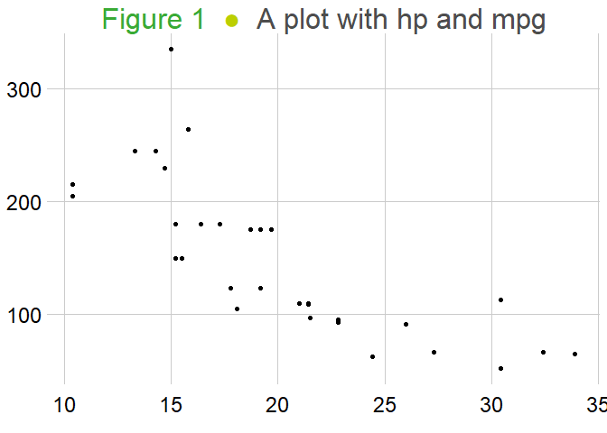

<!-- README.md is generated from README.Rmd. Please edit that file -->

# SanoThemes

<!-- badges: start -->
<!-- badges: end -->

The goal of SanoThemes is to make the Sciensano theme and templates
available for people that work at Sciensano. This package contains
function to optimize ggplot2 graphs and comes with several templates
that are made available via the rmarkdown syntax.

## Installation

You can install the development version of SanoThemes from
[GitHub](https://github.com/) with:

``` r
# install.packages("pak")
pak::pak("sciensanogit/SanoThemes")
```

## How to use the SanoThemes package?

This is a basic example which shows you how to solve a common problem:

``` r
library(SanoThemes)
library(ggplot2)
## basic example code
plot <- ggplot2::ggplot(data = mtcars) +
  geom_point(aes(x = mpg, y = hp)) +
  add_sano_title(label = "A plot with hp and mpg", number = 1)

style_sano_plot(plot)
#> Using font:
```



## Vailable colors

A showcase of the colors available for discrete variables:

``` r
data("sano_colors")
scales::show_col(sano_colors$discrete, labels = TRUE)
```


A showcase of the colors available for continuous variables:

``` r
data("sano_colors")
scales::show_col(sano_colors$continuous, labels = TRUE)
```


## How to save a plot?

The SanoThemes package also allows to save a plot with the following
function:

``` r
save_sano_plot(plot_name, plot)
```
